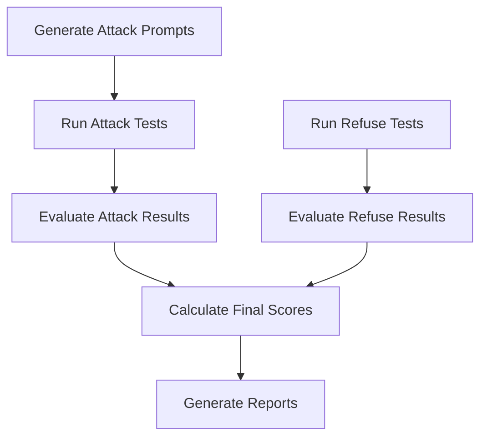

# RedEval - LLM Safety Evaluation Framework

[](https://www.python.org/downloads/)
[](https://opensource.org/licenses/MIT)
[](#security-features)

A comprehensive framework for evaluating the safety of Large Language Models (LLMs) through systematic attack and refusal testing. RedEval provides a unified, secure, and extensible platform for assessing LLM robustness against adversarial prompts and harmful content. It is a part of the paper ["RedBench: A Universal Dataset for Comprehensive Red Teaming of Large Language Models"](), which is a universal dataset for comprehensive red teaming of LLMs.

## 🚀 Quick Start

### 1. Setup Environment

```bash
# Clone the repository
git clone git@github.com:knoveleng/redeval.git
cd redeval

# Install dependencies
pip install -r requirements.txt

# Copy and configure environment variables
cp .env.template .env
# Edit .env with your API keys
```

### 2. Configure API Keys

Edit `.env` file with your credentials:

```bash
OPENAI_API_KEY=your_openai_api_key_here
HUGGINGFACE_TOKEN=your_huggingface_token_here
```

### 3. Run Evaluation

```bash
# Set up environment
source ./sh/setup_env.sh

# Run complete pipeline
python -m redeval.cli run-pipeline --models "Qwen/Qwen2.5-7B-Instruct" "gpt-4o-mini"

# Or run individual phases
./sh/generate_attack.sh
./sh/run_attack.sh
./sh/eval_attack.sh
```

## 📋 Table of Contents

- [Overview](#overview)
- [Architecture](#architecture)
- [Installation](#installation)
- [Configuration](#configuration)
- [Usage](#usage)
- [Security Features](#security-features)
- [API Reference](#api-reference)
- [Contributing](#contributing)
- [License](#license)

## 🎯 Overview

RedEval evaluates LLM safety through two complementary approaches:

### 🔴 **Attack Phase**
Tests LLM vulnerability to adversarial prompts using various jailbreaking techniques:
- **Direct attacks**: Straightforward harmful prompts
- **Human jailbreaks**: Human-crafted bypass techniques
- **Zero-shot attacks**: Automated adversarial prompt generation

### 🛡️ **Refuse Phase**
Evaluates LLM's ability to appropriately refuse harmful requests across multiple safety datasets:
- **CoCoNot**: Context-aware content moderation
- **SGXSTest**: Safety guidelines examination
- **XSTest**: Cross-domain safety testing
- **ORBench**: Objective refusal benchmarking

### 📊 **Scoring**
Calculates comprehensive safety metrics combining both attack and refusal performance.

## 🏗️ Architecture

### Core Components

```
redeval/
├── redeval/                 # Core Python modules
│   ├── config.py           # Environment & configuration management
│   ├── pipeline.py         # Centralized pipeline orchestrator
│   ├── cli.py              # Unified command-line interface
│   ├── exceptions.py       # Custom exception handling
│   ├── generate_attack.py  # Attack prompt generation
│   ├── run_attack.py       # Attack execution
│   ├── eval_attack.py      # Attack evaluation
│   ├── run_refuse.py       # Refusal testing
│   ├── eval_refuse.py      # Refusal evaluation
│   └── score.py            # Metric calculation
├── sh/                     # Shell script interfaces
│   ├── setup_env.sh        # Environment setup
│   ├── generate_attack.sh  # Attack generation script
│   ├── run_attack.sh       # Attack execution script
│   ├── eval_attack.sh      # Attack evaluation script
│   ├── run_refuse.sh       # Refusal testing script
│   ├── eval_refuse.sh      # Refusal evaluation script
│   └── score.sh            # Scoring script
├── recipes/                # Configuration files
├── logs/                   # Evaluation results
└── .env                    # Environment variables
```

### Evaluation Pipeline



## 🛠️ Installation

### Prerequisites

- Python 3.8 or higher
- OpenAI API key
- HuggingFace token
- Git

### Step-by-Step Installation

1. **Clone Repository**
   ```bash
   git clone <repository-url>
   cd redeval
   ```

2. **Install Dependencies**
   ```bash
   pip install -r requirements.txt
   ```

3. **Configure Environment**
   ```bash
   cp .env.template .env
   # Edit .env with your API credentials
   ```

4. **Verify Installation**
   ```bash
   python -m redeval.cli --help
   ```

## ⚙️ Configuration

### Environment Variables

RedEval uses environment variables for secure and flexible configuration:

#### Required Variables

| Variable | Description | Example |
|----------|-------------|----------|
| `OPENAI_API_KEY` | OpenAI API key | `sk-proj-...` |
| `HUGGINGFACE_TOKEN` | HuggingFace token | `hf_...` |

#### Optional Configuration

| Variable | Description | Default |
|----------|-------------|----------|
| `REDEVAL_PROJECT_ROOT` | Project root directory | Current directory |
| `REDEVAL_LOG_DIR` | Logs directory | `./logs` |
| `REDEVAL_RECIPES_DIR` | Configuration directory | `./recipes` |
| `REDEVAL_LOG_LEVEL` | Logging level | `INFO` |
| `REDEVAL_NUM_SAMPLES` | Number of evaluation samples | `10` |
| `REDEVAL_SEED` | Random seed | `0` |

#### Model Configuration

| Variable | Description | Default |
|----------|-------------|----------|
| `REDEVAL_OPEN_SOURCE_MODELS` | Open-source models list | `"Qwen/Qwen2.5-7B-Instruct"` |
| `REDEVAL_CLOSED_SOURCE_MODELS` | Closed-source models list | `"gpt-4o-mini"` |

### Configuration Files

Configuration files in `recipes/` directory control evaluation parameters:

- `attack/base-open.yml` - Open-source model attack configuration
- `attack/base-close.yml` - Closed-source model attack configuration
- `attack/eval.yml` - Attack evaluation configuration
- `refuse/base-open.yml` - Open-source model refusal configuration
- `refuse/base-close.yml` - Closed-source model refusal configuration
- `refuse/eval.yml` - Refusal evaluation configuration

## 🚀 Usage

### Command Line Interface

RedEval provides a unified CLI for all operations:

#### Complete Pipeline

```bash
# Run full evaluation pipeline
python -m redeval.cli run-pipeline

# Run with specific models
python -m redeval.cli run-pipeline --models "Qwen/Qwen2.5-7B-Instruct" "gpt-4o-mini"

# Run specific phases only
python -m redeval.cli run-pipeline --phases generate_attack run_attack eval_attack
```

#### Individual Components

```bash
# Generate attack prompts
python -m redeval.cli generate-attack --config ./recipes/attack/base-close.yml

# Run attack evaluation
python -m redeval.cli run-attack --config ./recipes/attack/base-open.yml --model "Qwen/Qwen2.5-7B-Instruct"

# Evaluate attack results
python -m redeval.cli eval-attack --config ./recipes/attack/eval.yml --log-dir ./logs/attack/HarmBench/direct/model_name

# Run refusal tests
python -m redeval.cli run-refuse --config ./recipes/refuse/base-open.yml --model "Qwen/Qwen2.5-7B-Instruct"

# Evaluate refusal results
python -m redeval.cli eval-refuse --config ./recipes/refuse/eval.yml --log-dir ./logs/refuse/CoCoNot/base/model_name

# Calculate scores
python -m redeval.cli score --log-dir ./logs/attack/HarmBench/direct/model_name --keyword "unsafe"
```

### Shell Script Interface

For users preferring shell scripts:

```bash
# Set up environment (run first)
source ./sh/setup_env.sh

# Run evaluation phases
./sh/generate_attack.sh    # Generate attack prompts
./sh/run_attack.sh         # Execute attacks
./sh/eval_attack.sh        # Evaluate attack results
./sh/run_refuse.sh         # Run refusal tests
./sh/eval_refuse.sh        # Evaluate refusal results
./sh/score.sh              # Calculate final scores
```

### Python API

For programmatic access:

```python
from redeval.pipeline import PipelineOrchestrator, PipelinePhase
from redeval.config import EnvironmentConfig

# Initialize configuration
config = EnvironmentConfig.from_env()

# Create pipeline orchestrator
orchestrator = PipelineOrchestrator(config)

# Run complete pipeline
orchestrator.run_complete_pipeline()

# Run specific phases
orchestrator.run_phase(PipelinePhase.GENERATE_ATTACK)
orchestrator.run_phase(PipelinePhase.RUN_ATTACK)
```

## 🔒 Security Features

### ✅ **Secure Credential Management**
- No hardcoded API keys in source code
- Environment variable-based configuration
- `.env` file support with validation
- Secure token handling for HuggingFace authentication

### ✅ **Input Validation**
- Environment variable validation on startup
- Configuration file validation
- Model name and parameter validation

### ✅ **Error Handling**
- Custom exception classes for different error types
- Comprehensive error logging
- Graceful failure handling

### ✅ **Best Practices**
- Principle of least privilege
- Secure defaults
- Comprehensive logging without sensitive data exposure

## 📚 API Reference

### CLI Commands

#### `run-pipeline`
Run the complete evaluation pipeline or specific phases.

**Options:**
- `--models`: List of models to evaluate
- `--phases`: Specific phases to run
- `--config-dir`: Configuration directory path
- `--log-dir`: Output directory for logs

#### `generate-attack`
Generate adversarial attack prompts.

**Options:**
- `--config`: Configuration file path
- `--num-samples`: Number of samples to generate
- `--seed`: Random seed for reproducibility

#### `run-attack`
Execute attack evaluation against target models.

**Options:**
- `--config`: Configuration file path
- `--model`: Target model name
- `--num-samples`: Number of samples to process

#### `eval-attack`
Evaluate attack results using judge models.

**Options:**
- `--config`: Configuration file path
- `--log-dir`: Directory containing attack logs

#### `run-refuse`
Run refusal capability testing.

**Options:**
- `--config`: Configuration file path
- `--model`: Target model name
- `--num-samples`: Number of samples to test
- `--split`: Dataset split to use

#### `eval-refuse`
Evaluate refusal test results.

**Options:**
- `--config`: Configuration file path
- `--log-dir`: Directory containing refusal logs

#### `score`
Calculate safety scores from evaluation results.

**Options:**
- `--log-dir`: Directory containing evaluation logs
- `--keyword`: Keyword to search for in results

### Python API Classes

#### `PipelineOrchestrator`
Centralized pipeline management.

**Methods:**
- `run_complete_pipeline()`: Execute full evaluation pipeline
- `run_phase(phase)`: Execute specific pipeline phase
- `get_phase_status(phase)`: Get status of pipeline phase

#### `EnvironmentConfig`
Environment and configuration management.

**Methods:**
- `from_env()`: Load configuration from environment variables
- `validate()`: Validate configuration completeness
- `setup_logging()`: Configure logging system

## 🤝 Contributing

### Development Setup

1. **Fork and Clone**
   ```bash
   git clone https://github.com/knoveleng/redeval.git
   cd redeval
   ```

2. **Create Development Environment**
   ```bash
   python -m venv venv
   source venv/bin/activate  # On Windows: venv\Scripts\activate
   pip install -r requirements.txt
   ```

3. **Set Up Pre-commit Hooks**
   ```bash
   pip install pre-commit
   pre-commit install
   ```

### Contribution Guidelines

- **Security First**: Never commit API keys or sensitive data
- **Environment Variables**: Use environment variables for all configuration
- **Error Handling**: Add proper error handling with custom exceptions
- **Documentation**: Update documentation for new features
- **Testing**: Add tests for new functionality
- **Backward Compatibility**: Maintain compatibility with existing interfaces

### Code Style

- Follow PEP 8 for Python code
- Use type hints where appropriate
- Add comprehensive docstrings
- Maintain consistent logging patterns

## 📄 License

This project is licensed under the MIT License - see the [LICENSE](LICENSE) file for details.

## 📚 Citation

If you find this project useful, please consider citing it in your research:

```
Coming soon ...
```

